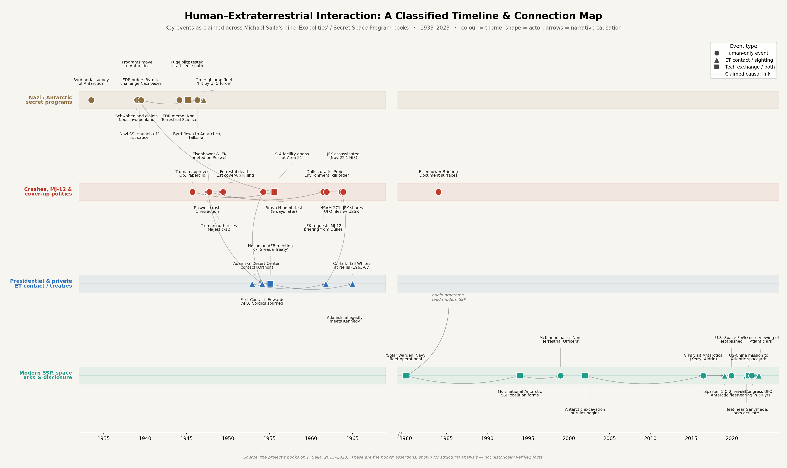

# Eksplorasi Isi Buku Michael Salla

Michael Salla menulis buku-buku yang bertemakan eksopolitik. Isinya menceritakan aktivitas di luar berita dan pengetahuan publik, yang entah benar atau tidak. Aktivitas tersebut melibatkan masyarakat atau individu umum, pemerintah, organisasi rahasia, dan alien. Selain itu termuat pula penjelasan mengenai teknologi tinggi, lingkungan aneh di dalam Bumi dan situasi di planet lain serta satelitnya.

Halaman ini memuat catatan eksplorasi isi buku tersebut menggunakan Large Language Model (LLM) Gemini, Claude dan ChatGPT. Kesesuaian hasil analis oleh LLM dengaan isi yang termuat di dalam buku, tidak saya verifikasi, kecuali pada bagian tertentu yang saya beri tanda. Prompt (promp chat dan prompt di *system instruction*) yang saya gunakan juga dapat dilihat di dalam direktori setiap topik. Buku dilampirkan dalam format teks agar LLM efisien (token kecil) dalam memprosesnya. 

Halaman ini bersifat dinamis, selalu berubah kapanpun ada informasi baru yang saya hasilkan.

## ClaudeAi
Saya memanfaatkan **Project** dan memasukan semua buku dalam *Project Knowledge*. Saya juga memanfaatkan **Skill** dan menyusunnya menggunakan fitur membuat *Skill* di ClaudeAi. Semua *Skill* yang saya gunakan ada di [Daftar Skill](Skill/)

## Gemini
Saya menggunakan fitur koneksi *NotebookLM* dengan chat *Gemini*. *Skill* dari **ClaudeAi** diletakkan dalam *System Instruction* pada *NotebookLM setting*. Konten dihasilkan baik dari chat di halaman *Gemini* maupun di halaman *NotebookLM*.

## Daftar Buku
1. **Antarctica's Hidden History, Corporate Foundations of Secret** -- Michael Salla -- 2018 -- Exopolitics Consultants -- 6a8bf1b70dfbdedbb51120215b98b147 -- Anna’s Archive.epub
2. **Galactic Diplomacy_ Getting to Yes with ET** -- Michael Salla [Salla, Michael] -- 2013 -- Exopolitics Institute -- 85fb6d20ff9ed724ebab1ab6863f830c -- Anna’s Archive.epub
3. **Insiders Reveal Secret Space Programs & Extraterrestrial** -- Salla, Michael -- 2015 -- Exopolitics Institute -- 7d0e4f7cab7b3660e8ea5f2c73b1695b -- Anna’s Archive.epub
4. **Kennedy's Last Stand_ Eisenhower, UFOs, MJ-12 & JFK's** -- Michael Salla [Salla, Michael] -- 2013 -- Exopolitics Institute -- 2e8dbfe887fdb9699c3c4a7e47c09fe9 -- Anna’s Archive.epub
5. **Secret Space Programs, Book 6 _ Space Force_ Our Star Trek** -- Michael Salla -- Secret Space Programs; 6, 2021 -- Exopolitics Consultants -- 9f81ca5590d79153ae350d2e768f44c1 -- Anna’s Archive.epub
6. **The U_S_ Navy's Secret Space Program and Nordic** -- Salla, Michael -- Secret Space Programs 2, 2017 -- Exopolitics Consultants -- c43ef25a492df5d84063b7ab51f0d05e -- Anna’s Archive.epub
7. **US Army Insider Missions_ Space Arks, Underground Cities** & -- Michael Salla -- 2023 -- d6ca88c971728a1a115a9154ad97cc32 -- Anna’s Archive.epub

## Catatan
Jika dalam suatu direktori terdapat file *Belum_Selesai_Upload.md*, berarti masih dalam pengerjaan.
